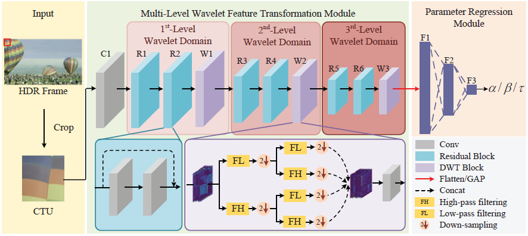

# WRNN
To accurately predict the parameters of the proposed piecewise
R-λ model for HDR intra coding, a WRNN is proposed,
which consists of a multi-level wavelet feature transformation
module (MWFTM) and a parameter regression module
(PRM). The MWFTM is proposed to achieve frequency-level
separation of pixel domain features for effectively capturing
frequency domain features that are sensitive to HDR characteristics.
The PRM utilizes the extracted frequency domain
features for piecewise R-λ model parameter estimation.


### Dataset

Original OpenEXR File | https://pan.baidu.com/s/17DqrWl7rU9juVsxrMGadKg  pass: 2m98 |

Training Data         | https://pan.baidu.com/s/1obReU3R_IhjpecY2ZaoIDw  pass: evqq |

### Training and Testing
```bash
CUDA_VISIBLE_DEVICES=0 python main_hdr_C.py
CUDA_VISIBLE_DEVICES=0 python test.py
```

## Requirements
- PyTorch
- Torchvision
- time
- numpy
- os
- tqdm
- functools
- openpyxl
- scipy


## Citation

If you find our paper or code useful for your research, please cite:

```BibTex
@ARTICLE{10736428,
  author={Yuan, Feng and Lei, Jianjun and Pan, Zhaoqing and Peng, Bo and Xie, Haoran},
  journal={IEEE Transactions on Image Processing}, 
  title={λ-Domain Rate Control via Wavelet-Based Residual Neural Network for VVC HDR Intra Coding}, 
  year={2024},
  volume={33},
  number={},
  pages={6189-6203},
  doi={10.1109/TIP.2024.3484173}}
```